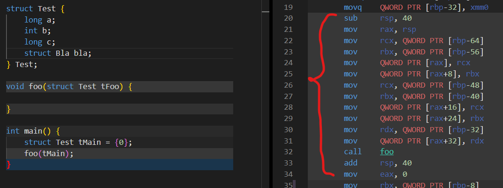

# Structs
## Factdump
- Each struct is one block in memory  
`struct Foo {a: u32, b: i32}` is 8 bytes  
4 bytes for `a` and 4 bytes for `b`
- Recursion is not possible, so if `Foo` has field of type `Bar`, `Bar` cant have field `Foo`  
Note: This should be possible later on with Pointers and Heap Allocation
- Therefore, size of Struct is known at compile time -> `Foo` is 8 bytes and will never be bigger/smaller
- Structs can be on the stack because of that
- Getting the field of a Struct is achieved by calculating the offset of that field  
`Foo.a` has offset 0, because it's the first field  
`Foo.b` has offset 4, because the field(s) before it are 4 bytes big
- Nested Structs work the same:  
-> Get offset, repeatedly add it to original offset  
-> Possible at compile time, because Struct sizes are known at compile time
- Storing/Loading field is then done using normal `mov`-Load with correct word size
## Passing Struct as Assignment
- Example: Assign struct `Foo {a: 5u32, b: 10i32 }` from above to variable `t` with stack-offset `4`
- Pass by Reference vs Value
- Reference is whack, because we're working on the Stack, screams for Memory-Unsafety
- Value, even if sub-optimal because hard-copy, seems more reasonable
- Can still add Pointers back later and get PbR that way
-> `t.a` is at stack-offset `4+offset(a)=4+0=4`
- `t.b` is at stack-offset `4+offset(b)=4+4=8`
- 2 moves:  
-> `mov DWORD [stack-4-4], 5`  
-> `mov DWORD [stack-8-4], 10`  
-> Both cases additional `-4` because type-size-offset
- This way of storing is already working for `StmtLet`
- No difference in `StmtAssign`, all offsets are known and can be taken into consideration
## Passing Struct as Argument 
- Again two ways: Reference or Value
- consider
    ```
    struct Test { a: u32, b: i32 }
    func foo(tFoo: Test) {}
    func main() {
        let tMain: Test = Test {
            a: 420,
            b: 69
        };
        foo(tMain);
    }
    ```  
- Reference is still whack, although more reasonable  
- Need to provide way of actually copying the struct when the user needs it  
- Still PbV as default, and Reference using Pointers in the future
- Introduce Pass by Value:
-> We know everything we need:
- We know offsets of `tMain` and `tFoo`, and we know the stack sizes of `main` and `foo`
- Theoretically we could just `mov [tFoo.a], [tMain.a]` and `mov [tFoo.b], [tMain.b]`
- Problem: in ASM that's `mov [rbp-offset(tFoo.a)], [rbp-offset(tMain.a)]` etc.
- Both use same stack frame, in our example we would overwrite `tMain` -> Very bad!!!
- If we use a register to store the new stack offset, we could then write `mov [newStack-offset(tFoo.a)], [oldStack-offset(tMain.a)]` and then treat arg/param as simple Assignment
- This is exactly what C does when the Struct doesn't fit in a single register  

- We would then need to handle StackFrame in `convert_expr(ExprCall)` instead of `convert_param()`, and tell `convert_fn()` to not do any parameter stuff, that's now the task of the caller
## Passing Struct as Return Value
- It's kinda basically the same as passing it as argument, except finding the correct destination is more difficult
- We can modify Codegen to keep track of which variable, in which function, we're currently assigning to
- This way we can at Compile Time figure out the correct offsets
- We cant really treat return the same as parameters (caller handles it all), because called function can contain multiple return statements
- We could however treat the return-stack-offset the same as parameters, in order `param-return-local`, such that any `return` simply writes to that region before returning
- Then we could treat return the same as param, and reverse the `mov` ops